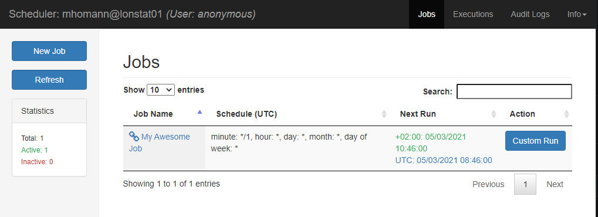

# simple_scheduler

[](LICENSE.txt)

This is the original reference implementation of [Nextdoor/ndscheduler](https://github.com/Nextdoor/ndscheduler).

It has been separated out in the fork [palto42/ndscheduler](https://github.com/palto42/ndscheduler) to make the code more maintainable.

## Usage

To use this test implementation of ndscheduler, it is recommended to create a Python
virtual environment and install this library with it's dependencies in it.

```sh
python3.7 -m venv .venv
source .venv/bin/activate
pip install -U .
# run with default settings
.venv/bin/simple_scheduler -s simple_scheduler.settings
```

Open a web browser at http://localhost:8888



### Sample jobs

The reference implementation also comes with [several sample jobs](simple_scheduler/jobs).

* AwesomeJob: it just prints out 2 arguments you pass in.
* SlackJob: it sends a slack message periodically, for example, team standup reminder.
* ShellJob: it runs an executable command, for example, run curl to crawl web pages.
* CurlJob: it's like running [curl](http://curl.haxx.se/) periodically.

## CLI options

```txt
usage: simple_scheduler [-h] [--http-port 80-65535]
                        [--http-address HTTP_ADDRESS]
                        [--nd-settings NDSCHEDULER_SETTINGS_MODULE] [--debug]
                        [--logging-level LOGGING_LEVEL] [--encrypt]
                        [--yaml-config YAML_CONFIG]

NDscheduler - web based cron replacement

optional arguments:
  -h, --help            show this help message and exit
  --http-port 80-65535, -p 80-65535
                        web server port
  --http-address HTTP_ADDRESS, -a HTTP_ADDRESS
                        web server IP address
  --nd-settings NDSCHEDULER_SETTINGS_MODULE, -s NDSCHEDULER_SETTINGS_MODULE
                        Python module with the settings to be used.
  --debug               enable debug mode
  --logging-level LOGGING_LEVEL, -l LOGGING_LEVEL
                        logging level
  --encrypt, -e         Create hash value from password for use in
                        AUTH_CREDENTIALS.
  --yaml-config YAML_CONFIG, -y YAML_CONFIG
                        Path to yaml config file
```

## Docker

The Dockerfile in the folder `./docker`has not yet been updated to work with this separate reference implementation.
